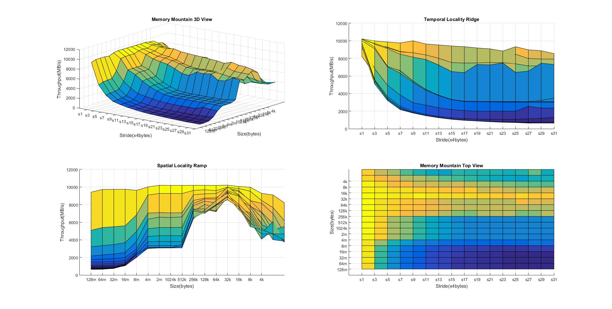

 
Memory Mountain
===============

Cross-Platform (linux/windows) CPU Cache Memory Mountain Viewer

Demo: `cd memory_mountain\demo` and run `demo.bat`

- __memory_mountain.exe__ prints data. cmd > `display_mountain > mountain.txt`
- __display_mountain.m__ read data and display. matlab > `display_mountain mountain.txt`

[Download Release](./releases/tag/memory_mountain)

References:

1. Computer Systems: A Programmer's Perspective
2. https://zh.wikipedia.org/wiki/%E5%AD%98%E5%82%A8%E5%99%A8%E5%B1%B1
3. http://www.cs.cmu.edu/afs/cs/academic/class/15213-f05/code/mem/mountain/
4. [What is an alternative to including sys/times.h on windows?](http://stackoverflow.com/questions/24741553/what-is-an-alternative-to-including-sys-times-h-on-windows)
5. https://code.google.com/p/madp-win/source/browse/src/include/sys/times.h
